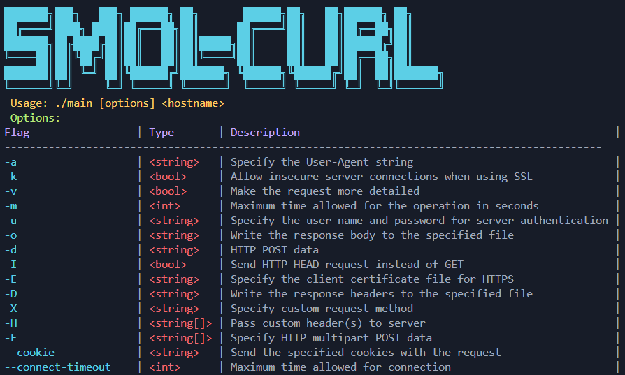

A minimal clone of cURL



### Installation

To build the program, use the following command:
```
go build main.go
```

To run the program, use the following syntax:
```
./main [options] <URL>
```

### Generate certificates required for -E flag
```
# Generate a private key
openssl genpkey -algorithm RSA -out client-key.pem

# Generate a certificate signing request (CSR)
openssl req -new -key client-key.pem -out client-req.pem

# Generate a self-signed certificate
openssl x509 -req -days 365 -in client-req.pem -signkey client-key.pem -out client-cert.pem

# Combine key and certificate into a single file
cat client-key.pem client-cert.pem > client.pem
```

### Examples

1. `-a` `<string>`: Specify the User-Agent string
```
./main -a "MyCustomUserAgent/1.0" http://example.com
```

2. `-k` `<bool>`: Allow insecure server connections when using SSL
```
./main -k https://self-signed.badssl.com/
```

3. `-v` `<bool>`: Make the request more detailed
```
./main -v http://example.com
```

4. `-m` `<int>`: Maximum time allowed for the operation in seconds
```
./main -m 10 http://example.com
```

5. `-u` `<string>`: Specify the user name and password for server authentication
```
./main -u "username:password" http://example.com/protected
```

6. `-d` `<string>`: HTTP POST data
```
./main -d "name=JohnDoe&age=30" http://example.com/form-submit
```

7. `-o` `<string>`: Write the response body to the specified file
```
./main -o "output.html" http://example.com
```

8. `-I` `<bool>`: Send HTTP HEAD request instead of GET
```
./main -I http://example.com
```

9. `-E` `<string>`: Specify the client certificate file for HTTPS
```
./main -E "client-cert.pem" https://example.com
```

10. `-D` `<string>`: Write the response headers to the specified file
```
./main -D "headers.txt" http://example.com
```

11. `-X` `<string>`: Specify custom request method
```
./main -X "DELETE" http://example.com/resource/123
```

12. `-H` `<string[]>`: Pass custom header(s) to server
```
./main -H "X-Custom-Header: value" -H "Another-Header: another-value" http://example.com
```

13. `-F` `<string[]>`: Specify HTTP multipart POST data
```
./main -F "field1=value1" -F "field2=@/path/to/file" http://example.com/upload
```

14. `--cookie` `<string>`: Send the specified cookies with the request
```
./main --cookie "sessionId=abc123" http://example.com
```

15. `--connect-timeout` `<int>`: Maximum time allowed for the connection to be established in seconds
```
./main --connect-timeout 5 http://example.com
```

### Note:
- The client supports both HTTP and HTTPS requests.
- The program will automatically attempt to use TLS when making requests to https:// URLs.
- The -k flag is useful when dealing with servers that have self-signed or otherwise invalid SSL certificates.
- The -D and -o flags can be used together to save both headers and body separately.
- If both -F and -d flags are used, the -F flag takes precedence, and the request will be sent as multipart/form-data.

### Building `smol-curl` from scratch
- Run `git clone https://github.com/smol-go/smol-curl`
- Run `make build`
- For cross-platform builds, run `make build-all` (optional)